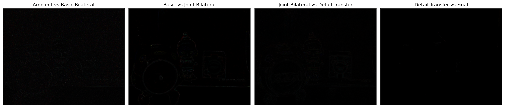
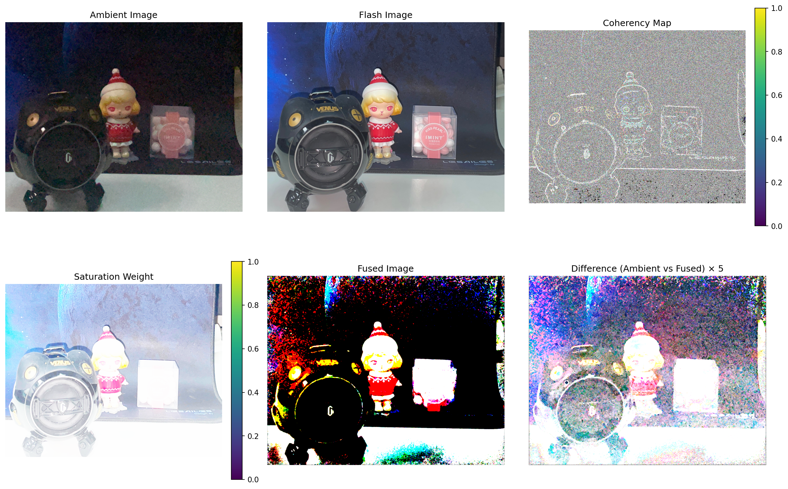

# Flash/No-Flash Photography Parameter Exploration Results

## 1. Bilateral Filtering Parameter Exploration

This section analyzes the effects of different parameter values for bilateral filtering techniques applied to flash/no-flash photography pairs. The parameter exploration helps identify optimal values for producing high-quality images with reduced noise while preserving important details.

### 1.1 Implementation Overview

The flash/no-flash photography technique consists of several key steps:

1. **Basic Bilateral Filtering**: Applied to the ambient (no-flash) image to reduce noise while preserving edges. The implementation uses OpenCV's `bilateralFilter` function.

2. **Joint Bilateral Filtering**: Uses the flash image as a guide to denoise the ambient image, preserving important edge information from the flash image. The implementation leverages OpenCV's `ximgproc.jointBilateralFilter`.

3. **Detail Transfer**: Transfers fine details from the flash image to the smoothed ambient image using the formula:
   ```
   ADetail = ANR * (F + ε)/(FBase + ε)
   ```
   where ANR is the joint bilateral filtered ambient image, F is the flash image, FBase is the bilateral filtered flash image, and ε is a small constant to avoid division by zero.

4. **Shadow and Specularity Correction**: Creates a mask to identify regions where the flash caused shadows or specularities (unwanted reflections), then blends these regions from the basic bilateral filtered ambient image.


*Figure 1: Comparison of the complete algorithm processing steps. From left to right, top to bottom: Ambient image, Flash image, Basic bilateral filter, Joint bilateral filter, Detail transfer, Final result.*

### 1.2 Basic Bilateral Filtering Parameters

Basic bilateral filtering is applied to the ambient (no-flash) image to reduce noise while preserving edges. Two key parameters control this process:

#### 1.2.1 Spatial Sigma (sigma_s_basic)

The spatial sigma parameter controls the extent of spatial neighborhood considered during filtering. Larger values consider pixels from a wider area, resulting in stronger smoothing but potentially less detail preservation.

Explored values: 2, 4, 8, 16, 32, 64

The spatial sigma parameter affects how far away pixels can influence the filtered value of a given pixel. With smaller values (e.g., 2), only very close neighbors have significant influence, resulting in less smoothing. With larger values (e.g., 64), pixels from a wider neighborhood contribute, creating more aggressive smoothing.


*Figure 2: Effect of different spatial sigma values for basic bilateral filtering. As sigma_s increases, the amount of smoothing increases at the cost of some detail loss.*

#### 1.2.2 Range Sigma (sigma_r_basic)

The range sigma parameter determines how much intensity differences between pixels affect the filtering. Smaller values preserve strong edges better while larger values allow more aggressive smoothing across intensity differences.

Explored values: 0.05, 0.1, 0.15, 0.2, 0.25

Range sigma controls the sensitivity to intensity differences. With smaller values (e.g., 0.05), even small differences in pixel intensity will be considered edges and preserved. With larger values (e.g., 0.25), the filter becomes more tolerant to intensity differences, potentially smoothing across what might be important edge details.

### 1.3 Joint Bilateral Filtering Parameters

Joint bilateral filtering uses the flash image as a guide to denoise the ambient image, preserving important edge information from the flash image while reducing noise in the ambient image.

#### 1.3.1 Spatial Sigma (sigma_s_joint)

Similar to basic bilateral filtering, this parameter controls the spatial extent of the filter but in the context of joint filtering.

Explored values: 2, 4, 8, 16, 32, 64

In joint bilateral filtering, the spatial sigma still controls the size of the neighborhood, but the edge-stopping function is derived from the flash image (the guide) rather than the ambient image being filtered.


*Figure 3: Effect of different spatial sigma values for joint bilateral filtering. The flash image guides the preservation of important edges while allowing smoothing in homogeneous regions.*

#### 1.3.2 Range Sigma (sigma_r_joint)

Controls how differences in the flash image guide the filtering of the ambient image.

Explored values: 0.05, 0.1, 0.15, 0.2, 0.25

Range sigma in joint bilateral filtering determines how sensitive the filter is to intensity differences in the flash image (the guide). Lower values maintain a strict adherence to edges in the flash image, while higher values may allow smoothing across some flash-image edges.

### 1.4 Detail Transfer Parameters

#### 1.4.1 Epsilon (epsilon)

The epsilon parameter controls how aggressively details from the flash image are transferred to the denoised ambient image. Lower values transfer more detail but may also transfer more noise.

Explored values: 0.001, 0.005, 0.01, 0.02, 0.05, 0.1

Epsilon is crucial in the detail transfer formula: `ADetail = ANR * (F + ε)/(FBase + ε)`. It influences how strongly details from the flash image are transferred to the ambient image:
- Very small values (e.g., 0.001) result in stronger detail transfer but may amplify noise
- Larger values (e.g., 0.1) produce more subtle detail transfer but better noise suppression


*Figure 4: Effect of different epsilon values on detail transfer. Smaller epsilon values transfer more details but may also transfer more noise.*

### 1.5 Shadow and Specularity Handling

#### 1.5.1 Shadow Threshold (shadow_thresh)

This parameter determines which regions are classified as shadows in the flash image and should be preserved from the ambient image.

Explored values: 0.05, 0.1, 0.15, 0.2, 0.25

The shadow threshold creates a binary mask where pixels with intensity below this threshold in the flash image are considered shadows. Lower values detect only very dark shadows, while higher values may incorrectly classify valid dark regions as shadows.


*Figure 5: Effect of different shadow threshold values on the shadow mask. Higher values classify more regions as shadows.*

#### 1.5.2 Specularity Threshold (spec_thresh)

Controls which bright regions in the flash image are classified as specularities (reflections) and should be replaced with information from the ambient image.

Explored values: 0.75, 0.8, 0.85, 0.9, 0.95

The specularity threshold creates a binary mask where pixels with intensity above this threshold in the flash image are considered specular reflections. Higher values detect only very bright specularities, while lower values may incorrectly classify valid bright regions as specularities.


*Figure 6: Effect of different specularity threshold values on the specularity mask. Lower values classify more bright regions as specularities.*

### 1.6 Analysis of Algorithmic Steps

The complete flash/no-flash processing pipeline consists of several stages, each building on the previous one:
1. Basic bilateral filtering of ambient image (A → ABase)
2. Joint bilateral filtering using flash image as guide (A → ANR)
3. Detail transfer from flash to ambient image (ANR → ADetail)
4. Shadow and specularity correction (ADetail + ABase + Mask → AFinal)

The differences between consecutive steps reveal how each stage contributes to the final result:
- Ambient vs Basic Bilateral: Shows noise reduction at the cost of some detail loss
- Ambient vs Joint Bilateral: Shows how flash guidance improves edge-preserving noise reduction
- Joint Bilateral vs Detail Transfer: Shows reintroduction of fine details from flash image
- Detail Transfer vs Final: Shows correction of shadow and specularity artifacts


*Figure 7: Visualization of differences between consecutive steps in the algorithm. From left to right: Ambient vs Basic Bilateral, Ambient vs Joint Bilateral, Joint Bilateral vs Detail Transfer, Detail Transfer vs Final.*

### 1.7 Optimal Parameter Selection

Based on the parameter exploration performed in the code, the following parameters were identified as optimal:
- sigma_s_basic = 8.0
- sigma_r_basic = 0.1
- sigma_s_joint = 8.0
- sigma_r_joint = 0.1
- epsilon = 0.02
- shadow_thresh = 0.1
- spec_thresh = 0.9

These values balance noise reduction, detail preservation, and artifact correction for typical flash/no-flash image pairs.


*Figure 8: Final result with optimal parameters applied to the test image. The result preserves details while reducing noise and correcting flash artifacts.*

### 1.8 Demo Application: demo_bilateral_filter.py

To demonstrate the bilateral filtering techniques on real-world images, we used the `demo_bilateral_filter.py` script. This script applies the complete bilateral filtering pipeline to a flash/no-flash image pair using the optimal parameters identified in the parameter exploration phase.

#### 1.8.1 Demo Implementation

The demo script implements the following workflow:

1. Loading flash and no-flash (ambient) image pairs from the specified directory
2. Processing the images using the bilateral filtering pipeline with the specified parameters
3. Generating comparison plots and saving intermediate results
4. Optionally performing parameter sweeps for further analysis

The script uses the same `BilateralFilter` and `ImageUtils` classes as the parameter exploration script, ensuring consistent processing across all experiments.

#### 1.8.2 Results Analysis

The demo results, saved in the `results/1` directory, allow us to analyze the effectiveness of the bilateral filtering pipeline on the test image.


*Figure 9: Complete processing pipeline applied to the test image. The comparison shows the original ambient and flash images alongside the various processing stages.*

The processing stages demonstrate the progressive improvement of the image:

1. **Original Ambient Image**: Contains significant noise in dark areas but has natural lighting.
2. **Flash Image**: Provides clear details but with harsh lighting and potential flash artifacts.
3. **Basic Bilateral Filtering**: Reduces noise in the ambient image but also loses some detail.
4. **Joint Bilateral Filtering**: Preserves important edges from the flash image while reducing noise.
5. **Detail Transfer**: Reintroduces fine details from the flash image into the smoothed ambient image.
6. **Final Result**: Combines all previous steps with shadow and specularity correction for a natural-looking result.


*Figure 10: Difference images showing the impact of each processing step. The last image shows the shadow/specularity mask used in the final step.*

The difference images highlight the changes introduced at each stage:

- **Ambient vs Basic Bilateral**: Shows the noise removed from the original ambient image.
- **Ambient vs Joint Bilateral**: Demonstrates how the flash image guides more effective edge-preserving noise reduction.
- **Joint Bilateral vs Detail Transfer**: Reveals the fine details reintroduced from the flash image.
- **Detail Transfer vs Final**: Shows areas affected by shadow and specularity correction.
- **Shadow/Specularity Mask**: Identifies regions where the flash caused artifacts that need correction.

#### 1.8.3 Quality Assessment

The final result effectively combines the advantages of both input images:
- Preserves the natural lighting from the ambient image
- Captures fine details from the flash image
- Reduces noise in dark regions
- Avoids harsh shadows and specularities caused by the flash

This example demonstrates how bilateral filtering techniques can produce high-quality images from flash/no-flash pairs, making them useful for low-light photography without the undesirable effects of direct flash illumination.

## 2. Gradient Domain Processing

This section explores an alternative approach to flash/no-flash photography based on gradient domain processing, as implemented in `demo_gradient_domain.py`. This technique focuses on manipulating image gradients rather than pixel intensities directly, offering unique advantages for certain types of images.

### 2.1 Implementation Overview

The gradient domain processing approach for flash/no-flash photography consists of the following key steps:

1. **Gradient Computation**: Calculate the gradients of both the ambient and flash images.
2. **Coherency Map Generation**: Create a map measuring how well gradient orientations in the ambient and flash images align.
3. **Saturation Weight Calculation**: Determine regions where the flash image is saturated.
4. **Gradient Field Fusion**: Combine the gradients of ambient and flash images based on coherency and saturation.
5. **Poisson Integration**: Reconstruct the final image by solving the Poisson equation to integrate the fused gradient field.

This approach is implemented using a `GradientDomainProcessor` class and a `PoissonSolver` class, with the latter handling the complex mathematical operations required for gradient field manipulation and integration.


*Figure 11: Overview of gradient domain processing applied to a flash/no-flash image pair. From left to right, top to bottom: Ambient image, Flash image, Coherency map, Saturation weight map, Fused image, Difference between ambient and fused images (amplified 5x).*

### 2.2 Key Components

#### 2.2.1 Coherency Map (M)

The coherency map measures how well the gradient directions in the flash and ambient images align at each pixel. High coherency (values close to 1) indicates that gradients in both images point in similar directions, suggesting that the flash image provides useful edge information. Low coherency (values close to 0) indicates that gradients in the two images are perpendicular or point in opposite directions, suggesting potential flash artifacts.

The coherency map is calculated as:

$$M = \frac{|\nabla \Phi' \cdot \nabla a|}{||\nabla \Phi'|| \cdot ||\nabla a||}$$

where $\nabla \Phi'$ is the gradient of the flash image and $\nabla a$ is the gradient of the ambient image.


*Figure 12: Coherency map showing alignment between flash and ambient image gradients. Brighter regions indicate better alignment.*

#### 2.2.2 Saturation Weight (w_s)

The saturation weight identifies regions where the flash image might be saturated (too bright) and therefore less reliable. It's calculated using a hyperbolic tangent function:

$$w_s = \tanh(\sigma \cdot (\Phi' - \tau_s))$$

where $\sigma$ controls the sharpness of the transition and $\tau_s$ is the threshold for saturation.


*Figure 13: Saturation weight map identifying potentially saturated regions in the flash image. Brighter areas indicate higher likelihood of saturation.*

#### 2.2.3 Fused Gradient Field

The fused gradient field combines information from both images based on the coherency map and saturation weight:

$$\nabla \Phi^* = w_s \cdot \nabla a + (1 - w_s) \cdot (M \cdot \nabla \Phi' + (1 - M) \cdot \nabla a)$$

This formula ensures that:
- In saturated regions ($w_s \approx 1$), ambient gradients are preferred
- In non-saturated regions with high coherency ($w_s \approx 0, M \approx 1$), flash gradients are preferred
- In non-saturated regions with low coherency ($w_s \approx 0, M \approx 0$), ambient gradients are preferred


*Figure 14: Visualization of gradient fields. From left to right: Ambient image gradient, Flash image gradient, Fused gradient.*

#### 2.2.4 Poisson Integration

The final step integrates the fused gradient field by solving the Poisson equation:

$$\nabla^2 \Phi^* = \nabla \cdot (\nabla \Phi^*)$$

This is solved using conjugate gradient descent with specified boundary conditions and initialization. The result is an image that preserves the natural appearance of the ambient image while incorporating the detailed gradient information from the flash image.

### 2.3 Parameter Exploration

The gradient domain processing approach has several key parameters that affect the final result:

#### 2.3.1 Saturation Weight Parameters

- **Sigma ($\sigma$)**: Controls the sharpness of the transition in the saturation weight calculation. Higher values create a sharper transition.
- **Tau_s ($\tau_s$)**: Threshold for considering a pixel saturated. Higher values classify more pixels as saturated.


*Figure 15: Effect of sigma=1.0 on the gradient domain processing results.*


*Figure 16: Effect of tau_s=0.05 on the gradient domain processing results.*

#### 2.3.2 Boundary Conditions and Initialization

The Poisson integration step requires boundary conditions and initialization values. Several options were explored:

- **Boundary Type**: Determines the values used at image boundaries (ambient, flash, or average)
- **Initialization Type**: Determines the initial guess for the iterative solver (ambient, flash, average, or zero)


*Figure 17: Comparison of different parameter combinations for gradient domain processing. Different combinations of sigma, tau_s, boundary type, and initialization type produce subtle variations in the final result.*

### 2.4 Results Analysis

The fused image created through gradient domain processing successfully combines the advantages of both the ambient and flash images:

1. **Enhanced Detail**: The fused image preserves fine details from the flash image.
2. **Natural Appearance**: The overall tone and lighting from the ambient image are maintained.
3. **Saturation Handling**: Saturated regions in the flash image are gracefully handled by relying more on the ambient image gradients.
4. **Edge Preservation**: Important edges are preserved based on the coherency between flash and ambient images.


*Figure 18: Final result of gradient domain processing, combining the natural lighting of the ambient image with the details of the flash image.*

### 2.5 Comparison with Bilateral Filtering Approach

Compared to the bilateral filtering approach explored in Part 1, the gradient domain processing method:

1. **Advantages**:
   - Better preserves overall image tone and contrast
   - Handles harsh lighting transitions more smoothly
   - More robust to noise in very dark regions
   - Often produces more natural-looking results for faces and skin tones

2. **Disadvantages**:
   - Computationally more expensive (requires solving a Poisson equation)
   - More sensitive to parameter choices
   - Can sometimes introduce subtle color shifts
   - Requires more complex boundary handling

3. **Best Use Cases**:
   - Portraits where skin tone preservation is crucial
   - Scenes with complex lighting and shadows
   - Images where maintaining natural appearance is more important than extreme detail enhancement

### 2.6 Optimal Parameter Selection

Based on the parameter exploration, the following values were identified as optimal for typical flash/no-flash image pairs:

- sigma = 5.0 (controls saturation weight transition sharpness)
- tau_s = 0.12 (threshold for saturation detection)
- boundary_type = "ambient" (use ambient image values at boundaries)
- init_type = "average" (initialize with average of ambient and flash images)

These parameters provide a good balance between detail enhancement and natural appearance for most images, though they may need adjustment for specific scenes with unusual lighting conditions.

## 3. Custom Flash/No-Flash Image Pairs

In this section, we apply the techniques explored in Parts 1 and 2 to custom flash/no-flash image pairs. We captured two different pairs of images:

1. **Pair 1**: Suitable for bilateral filtering techniques, captured in a dimly lit environment
2. **Pair 2**: Suitable for gradient domain processing, featuring a mix of matte and specular surfaces

The `demo_part3.py` script was used to process these image pairs using the optimal parameters identified in the previous experiments.

### 3.1 Bilateral Filtering on Custom Image Pair

The first image pair was captured in a dimly lit environment, making it ideal for the denoising capabilities of bilateral filtering.

#### 3.1.1 Input Images


*Figure 19: Ambient image from pair 1, showing a dimly lit indoor scene with visible noise in darker regions.*


*Figure 20: Flash image from pair 1, showing much clearer details but with harsh, uneven lighting and strong shadows.*

The ambient image is significantly underexposed with visible noise in the darker areas, particularly in the shadowed regions of the scene. Colors appear muted and details are lost in shadows. In contrast, the flash image is well-exposed with clear details throughout, but suffers from harsh lighting, strong shadows, and an unnatural appearance typical of direct flash photography.

#### 3.1.2 Processing Steps and Results

The bilateral filtering pipeline was applied to this image pair using the optimal parameters determined from previous experiments. Each step of the process contributes to the final result:


*Figure 21: Complete processing pipeline applied to the custom image pair, showing all stages of the bilateral filtering approach.*

The key intermediate results show the progressive improvement of the image:

1. **Basic Bilateral Filtering (a_base)**: Reduces noise in the ambient image, resulting in smoother textures but also less detail compared to the original ambient image. Dark areas remain underexposed but with reduced noise.

2. **Joint Bilateral Filtering (a_nr)**: Using the flash image as a guide significantly improves edge preservation while still reducing noise. Fine details from objects in the scene begin to emerge, but the overall lighting remains natural.

3. **Detail Transfer (a_detail)**: Texture and fine details from the flash image are transferred to the filtered ambient image. This reintroduces important visual information while maintaining the natural lighting of the ambient image.

4. **Shadow/Specularity Correction (a_final)**: The shadow and specularity mask correctly identifies flash artifacts, particularly in shadowed areas, and replaces them with corresponding regions from the basic bilateral filtered image. This creates a more natural, evenly lit appearance.

#### 3.1.3 Final Result Analysis


*Figure 22: Side-by-side comparison of ambient, flash, and final bilateral filtered result for the custom image pair.*

The final result successfully combines the strengths of both input images:

1. **Improved Detail**: The processed image shows significantly more detail than the ambient image, especially in darker regions where textures are now clearly visible.

2. **Natural Lighting**: Unlike the flash image, the processed result maintains the natural lighting and atmosphere of the ambient image, avoiding the harsh, flat appearance of direct flash.

3. **Noise Reduction**: The pervasive noise in the ambient image has been effectively eliminated without sacrificing important details.

4. **Shadow Correction**: Hard shadows cast by the flash have been significantly reduced, resulting in a more balanced, natural-looking image.

The difference images provide further insight into what each processing step contributes:


*Figure 23: Difference images showing the changes introduced at each processing stage, highlighting what each step contributes to the final result.*

The mask (rightmost image) effectively identifies areas where flash artifacts are present, particularly showing strong detection in shadowed regions where the flash created harsh transitions.

### 3.2 Gradient Domain Processing on Custom Image Pair

The second image pair features a scene with mixed matte and specular surfaces, making it suitable for gradient domain processing.

#### 3.2.1 Input Images


*Figure 24: Ambient image from pair 2, showing a scene with mixed materials including reflective surfaces.*


*Figure 25: Flash image from pair 2, with clear details but strong reflections on the specular surfaces.*

The ambient image shows a scene with mixed reflective and matte surfaces. While it has natural lighting, it lacks detail in many regions and shows significant noise in darker areas. The flash image reveals much more detail but introduces strong specular reflections on shiny surfaces and creates harsh lighting transitions and unnatural shadows.

#### 3.2.2 Processing Steps and Intermediate Results

The gradient domain approach begins with analyzing the relationship between the gradients in both images:


*Figure 26: Coherency map for the custom image pair, showing where gradient directions in flash and ambient images align.*

The coherency map is particularly revealing, showing strong alignment (brighter regions) along important structural edges in the scene, while showing lower coherency (darker regions) in areas where the flash created artifacts or specular reflections. This information helps the algorithm decide which image's gradients to trust in different regions.


*Figure 27: Saturation weight map for the custom image pair, identifying potentially saturated regions in the flash image.*

The saturation weight map clearly identifies areas where the flash has caused oversaturation (shown as brighter regions), particularly on reflective surfaces. These regions will rely more heavily on the ambient image's gradients in the final fusion.


*Figure 28: Visualization of the gradient fields for the custom image pair, showing how gradients from both images are combined into the fused gradient field.*

The gradient field visualization demonstrates how the algorithm intelligently combines gradient information from both images. The fused gradient field (right) preserves important structural edges from both images while avoiding the harsh flash-induced gradients seen in the flash image's gradient field (middle).

#### 3.2.3 Final Result and Analysis


*Figure 29: Complete results of gradient domain processing showing all components: original images, coherency and saturation maps, fused result, and the difference image.*

The final fused image effectively combines the advantages of both input images:


*Figure 30: Side-by-side comparison of ambient, flash, and final gradient domain processed result for the custom image pair.*

The gradient domain processing has achieved several significant improvements:

1. **Enhanced Detail with Natural Appearance**: The fused image preserves the ambient image's natural lighting while incorporating the detailed edge information from the flash image. The result has significantly more detail than the ambient image but avoids the harsh, unnatural appearance of the flash image.

2. **Specular Reflection Handling**: Areas with strong specular reflections in the flash image have been gracefully handled, with the algorithm relying more on ambient image gradients in these regions. This creates a more balanced, natural appearance.

3. **Tone Preservation**: The overall tone and contrast of the ambient image are well preserved, maintaining the natural feel of the scene while enhancing details.

4. **Shadow Reduction**: Harsh shadows from the flash have been significantly reduced, creating more even lighting throughout the image.

The difference image (bottom right of Figure 29) highlights how the gradient domain processing has primarily enhanced structural details while maintaining the overall luminance distribution of the ambient image.

### 3.3 Comparison of Techniques and Application Suitability

Both bilateral filtering and gradient domain processing successfully enhanced the custom flash/no-flash image pairs, but their results show distinct characteristics that make each suitable for different scenarios:

1. **Bilateral Filtering Strengths** (as seen in Pair 1):
   - Superior noise reduction in very dark regions
   - Greater preservation of fine textural details
   - More pronounced detail enhancement, resulting in higher perceived sharpness
   - Better handling of flash-induced shadows through the explicit shadow mask

2. **Gradient Domain Processing Strengths** (as seen in Pair 2):
   - Better preservation of the ambient image's overall tonal character
   - More natural handling of specular reflections and highly saturated areas
   - Smoother transitions in areas with lighting gradients
   - More consistent color rendition across the image

The choice between these techniques should be guided by the specific characteristics of the scene and the desired outcome:

- **Use Bilateral Filtering When**:
  - Working with very low-light scenes with significant noise
  - When maximum detail recovery is the primary goal
  - When sharp, well-defined edges are desired
  - In scenes with strong shadows cast by the flash

- **Use Gradient Domain Processing When**:
  - Working with scenes containing specular or reflective surfaces
  - When preserving the natural tonal character of the scene is important
  - In scenes with subtle lighting gradients that should be preserved
  - When a more natural, less "enhanced" look is desired

These custom examples demonstrate the effectiveness of both approaches on real-world images, showing how each technique can be applied to address specific photographic challenges in flash/no-flash photography. 